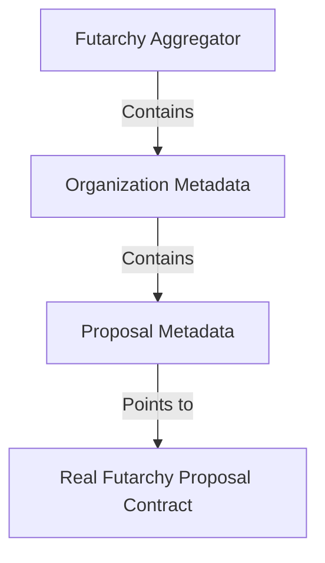

# Futarchy Aggregator System

A hierarchical, on-chain metadata system for organizing and indexing Futarchy proposals. Built with the **Clones Pattern** for gas-efficient deployments on Gnosis Chain.

---

## 🚀 What's New (v2.0)

> [!IMPORTANT]
> This version introduces **breaking changes** with renamed functions and new features.

### Key Improvements

| Feature | Why It Matters |
| :--- | :--- |
| **🔐 Editor Role** | Delegate day-to-day operations without transferring ownership. Great for multisigs assigning bots or team members. |
| **🗑️ Remove Functions** | Previously, once added, items couldn't be removed. Now you can clean up mistakes or deprecated items. |
| **⚡ One-Transaction Creation** | Create metadata AND link it in a single transaction instead of two. Saves gas and simplifies workflows. |
| **📝 Metadata Suffix Naming** | All functions now include "Metadata" in their names (e.g., `addProposalMetadata`) to clarify they manage metadata, not actual proposals. |

---

## 🛠️ Infrastructure Addresses (Gnosis Chain)

These factories deploy minimal proxies (Clones) which are cheap and auto-verified.

| Contract | Address |
| :--- | :--- |
| **Aggregator Factory** | [`0xB120358180c09B0aC3b5A908c9E01D84F6266482`](https://gnosisscan.io/address/0xB120358180c09B0aC3b5A908c9E01D84F6266482) |
| **Organization Factory** | [`0x08e31d771031711263b13A01D2dBb518f43Ef3f4`](https://gnosisscan.io/address/0x08e31d771031711263b13A01D2dBb518f43Ef3f4) |
| **Proposal Metadata Factory** | [`0xE518ea78F743fcC41fEad0f92C1792A0aD7999E3`](https://gnosisscan.io/address/0xE518ea78F743fcC41fEad0f92C1792A0aD7999E3) |

---

## 📐 Hierarchy Architecture



Each level can create and manage its children directly:
- **Aggregator** → `createAndAddOrganizationMetadata()` → Creates & links Organization in **1 tx**
- **Organization** → `createAndAddProposalMetadata()` → Creates & links Proposal in **1 tx**

---

## 🔐 Access Control (Owner + Editor)

All metadata contracts implement a **Two-Tier Permission System**:

| Role | Permissions |
| :--- | :--- |
| **Owner** | Full control: `setEditor()`, `revokeEditor()`, `transferOwnership()` + **all Editor permissions** |
| **Editor** | Write access: Add/Remove/Create items, Update metadata (**cannot** manage roles) |

### Why This Design?

1. **Separation of Concerns**: Owner keeps security control; Editor handles operations.
2. **Multisig-Friendly**: A DAO multisig can set a hot wallet or bot as Editor for quick updates.
3. **Revocable**: Owner can revoke Editor access anytime without complex ownership transfers.

```solidity
// Owner delegates to an Editor
aggregator.setEditor(0xTrustedAddress);

// Owner revokes Editor access
aggregator.revokeEditor();
```

---

## ⚡ One-Transaction Creation (New!)

> [!TIP]
> Save gas and reduce complexity by creating metadata and linking it in a single transaction.

### Before (2 Transactions)
```solidity
// TX 1: Create proposal metadata via factory
address proposalMeta = proposalFactory.createProposalMetadata(...);

// TX 2: Add to organization
organization.addProposalMetadata(proposalMeta);
```

### After (1 Transaction)
```solidity
// Single TX: Organization creates AND adds proposal metadata
address proposalMeta = organization.createAndAddProposalMetadata(
    0xProposalAddress,    // The real futarchy proposal
    "Will GNO reach $500?",
    "GNO Price Prediction",
    "Detailed description...",
    '{"category":"price"}',  // On-chain JSON metadata
    "ipfs://Qm..."            // IPFS URI for large data
);
```

### Setup Required

Before using `createAndAdd...` functions, the owner must set the implementation address:

```solidity
// For Organization to create proposals:
organization.setProposalImplementation(0xProposalImplAddress);

// For Aggregator to create organizations:
aggregator.setOrganizationImplementation(0xOrgImplAddress);
```

---

## 🗑️ Remove Functions

Organizations and Proposals can now be removed from their parent contracts.

| Function | Contract | Description |
| :--- | :--- | :--- |
| `removeOrganizationMetadata(uint256 index)` | Aggregator | Remove organization by index |
| `removeProposalMetadata(uint256 index)` | Organization | Remove proposal by index |

> [!NOTE]
> Uses *swap-and-pop* pattern for gas efficiency. The last item replaces the removed item, so **order is not preserved**.

---

## 💾 Dual Metadata Pattern

All contracts support both on-chain and off-chain metadata:

| Field | Purpose | Example |
| :--- | :--- | :--- |
| `metadata` | Small, critical JSON stored on-chain | `{"category":"governance","priority":"high"}` |
| `metadataURI` | IPFS/Arweave URI for large data | `ipfs://QmXyz...` |

---

## 📋 Complete API Reference

### FutarchyAggregatorsMetadata

| Function | Access | Description |
| :--- | :--- | :--- |
| `setOrganizationImplementation(address)` | Owner | Set impl for `createAndAdd...` |
| `setEditor(address)` | Owner | Set the editor address |
| `revokeEditor()` | Owner | Remove the editor |
| `addOrganizationMetadata(address)` | Owner/Editor | Add existing organization |
| `createAndAddOrganizationMetadata(...)` | Owner/Editor | Create & add in one tx |
| `removeOrganizationMetadata(uint256)` | Owner/Editor | Remove by index |
| `updateAggregatorInfo(string, string)` | Owner/Editor | Update name & description |
| `updateExtendedMetadata(string, string)` | Owner/Editor | Update metadata & metadataURI |

### FutarchyOrganizationMetadata

| Function | Access | Description |
| :--- | :--- | :--- |
| `setProposalImplementation(address)` | Owner | Set impl for `createAndAdd...` |
| `setEditor(address)` | Owner | Set the editor address |
| `revokeEditor()` | Owner | Remove the editor |
| `addProposalMetadata(address)` | Owner/Editor | Add existing proposal metadata |
| `createAndAddProposalMetadata(...)` | Owner/Editor | Create & add in one tx |
| `removeProposalMetadata(uint256)` | Owner/Editor | Remove by index |
| `updateCompanyInfo(string, string)` | Owner/Editor | Update name & description |
| `updateExtendedMetadata(string, string)` | Owner/Editor | Update metadata & metadataURI |

### FutarchyProposalMetadata

| Function | Access | Description |
| :--- | :--- | :--- |
| `setEditor(address)` | Owner | Set the editor address |
| `revokeEditor()` | Owner | Remove the editor |
| `updateMetadata(string, string, string)` | Owner/Editor | Update question, event, description |
| `updateExtendedMetadata(string, string)` | Owner/Editor | Update metadata & metadataURI |

---

## 🧪 How to Deploy

```bash
# Deploy all factories and implementations
npm run deployAggregator
```

This deploys:
1. **Implementations** (3 contracts) - The logic contracts
2. **Factories** (3 contracts) - Clone deployers pointing to implementations

---

## 🔗 Live Example (Gnosis Chain)

Existing instances created with the Clones Pattern:

1. **Aggregator**: [FutarchyFi (0xdc...0EE)](https://gnosisscan.io/address/0xdc5825b60462F38C41E0d3e7F7e3052148A610EE)
2. **Organization**: [GNOSIS DAO (0xe2...47)](https://gnosisscan.io/address/0xe204584Feb4564d3891739E395F6d6198F218247)
3. **Proposal Metadata**: [Metadata (0xA6...77)](https://gnosisscan.io/address/0xA62c418D49dd955df13C92F6939E1ebc09227077)
